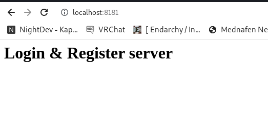

# User Login


Application that makes use of the Json Web Token and Spring Security.

It has been used for the embedded database:
  * H2
  
For Spring and its security:
  * Spring Security
  * Spring Data JPA
  * Spring Web
  * Spring Boot DevTools
  * JWT
  
For mapping an object into a json object:
  * Jackson

## Usage

By default the application doesn't allow for anything aside from registering and login and the defaul route, by default it includes the admin user with the password "password", you can try it by using the curl command:

        curl -i -H "Content-Type: application/json" -X POST -d '{ "username": "admin", "password": "password"}' http://localhost:8181/login
		
After that it will return the Bearer token that can be used for accessing the rest of the endpoints:

```json
{
  "accessToken": "<your_bearer_token>",
  "tokenType": "Bearer "
}

```

The default route includes a welcome message that one can access via curl or browser (it doesn't require login):


         curl -i -H "Content-Type: application/json" -X GET localhost:8181/
		 
```
HTTP/1.1 200 
Vary: Origin
Vary: Access-Control-Request-Method
Vary: Access-Control-Request-Headers
Access-Control-Allow-Credentials: true
Access-Control-Allow-Methods: POST, GET, OPTIONS, DELETE
Access-Control-Max-Age: 3600
Access-Control-Allow-Headers: Content-Type, Accept, X-Requested-With, remember-me, Host, Content-Lenght
X-Content-Type-Options: nosniff
X-XSS-Protection: 0
Cache-Control: no-cache, no-store, max-age=0, must-revalidate
Pragma: no-cache
Expires: 0
X-Frame-Options: DENY
Content-Type: text/plain;charset=UTF-8
Content-Length: 31
Date: Wed, 17 May 2023 07:23:23 GMT

<h1>Login & Register server<h1>
```

By accessing using the browser:



### Endpoints

One can use curl to specify the Bearer token and that will grant access to the rest of the endpoints:


  * The following is a GET request that gives the info of all the users, keep in mind that the password section is encrypted with the bcrypt password-hashing function[^1]:

        curl -H "Content-Type: application/json" -H "Authorization: Bearer <your_bearer_token>" -X GET localhost:8181/users | jq
		
```json
[
  {
    "id": 1,
    "username": "admin",
    "password": "$2a$10$XURPShQNCsLjp1ESc2laoObo9QZDhxz73hJPaEv7/cBha4pk0AgP.",
    "role": "admin"
  }
]
```

  * The following is a GET request that gives the info the user by giving the id (/users/{id}), keep in mind that the password section is encrypted with the bcrypt password-hashing function:
  
          curl -H "Content-Type: application/json" -H "Authorization: Bearer <your_bearer_token>" -X GET localhost:8181/users/1 | jq
		
```json
  {
    "id": 1,
    "username": "admin",
    "password": "$2a$10$XURPShQNCsLjp1ESc2laoObo9QZDhxz73hJPaEv7/cBha4pk0AgP.",
    "role": "admin"
  }
```

  * The following is a POST request that registers a new user to log in into and get the token. You can assign any role wanted, the application doesn't filter differently depending on the role, it is left there in case there's the need to implement roles when using this for a different project:
  
		curl -i -H "Content-Type: application/json" -X POST -d '{ "username": "rebeca", "password": "parole", "role": "admin"}' http://localhost:8181/register
		
  * The following is a PUT request that modifies the data of one of the users (/users/{id}):
  
		curl -i -H "Content-Type: application/json" -H "Authorization: Bearer <your_bearer_token>" -X PUT -d '{ "username": "rebeca", "password": "parole", "role": "normal"}' http://localhost:8181/users/2
		
  * The following is a DELETE request that deletes one of the users(/users/{id}):
  
		curl -H "Content-Type: application/json" -H "Authorization: Bearer <your_bearer_token>" -X DELETE localhost:8181/users/2 | jq

  * There's a filter that blocks deleting the id 1 which corresponds to the admin, that way we can avoid having an application where anyone can't log it.
## Running the project

This a Spring Boot which means it can be run in different ways, you can do it either by using Eclipse IDE:


Another alternative is going inside "./user_login" and use Maven from the command line:

	mvn spring-boot:run

## Author

Francisco Parra Pérez

## License 

[MIT](https://opensource.org/licenses/MIT)

[^1]: Keep in mind that you need to use the token the application provided
